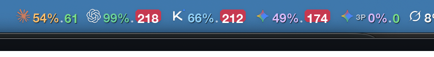

# Claude Usage — macOS Menu Bar

A pair of [xbar](https://xbarapp.com) plugins that sit in your macOS menu bar:

- **`claude-usage.5m.py`** — shows your real Anthropic Pro/Max weekly usage %, 5-hour session %, and a pace indicator (are you on track to stay under limits this week?). Pulls live data straight from the same endpoint that powers [claude.ai/settings/usage](https://claude.ai/settings/usage). Also shows Codex, Kimi (Kimi Code CLI), Google Antigravity (agy CLI), and Grok (xAI Grok CLI) usage — weekly %, 5h session %, pace, and extra-usage balance — sourced locally from each CLI's own data (Codex rollout logs; Kimi's OAuth token calling the same `api.kimi.com/coding/v1/usages` endpoint its `/usage` command uses; Antigravity's JSON output calling `agy --print /usage`; Grok's local credits log at `~/.grok/logs/unified.jsonl`). Features real brand Retina icons for each provider in the dropdown and authentic brand symbols in the menu bar.
- **`mac-health.1m.py`** — system load, memory pressure, zombie-process watchdog, and cleanup suggestions for heavy or leaked processes.



---

## What you see

**Menu bar headline:** `✳ 62%·69 ⬡ 99%·209 🌙 71%·215 ✦ 52%·170 ✦3P 0%·0 𝕏 8%·8`

(xbar draws this as a Retina image with real brand icons; the line above is the text fallback, captured from a live `./claude-usage.5m.py` run.)

- **Hybrid Coloring Scheme:**
  - **Weekly Usage %** is rendered in each provider's authentic brand color (dark / light):
    - Claude: apricot (`#FEB95F`) / terracotta (`#C4411E`)
    - Codex: mint emerald (`#34D399`) / forest emerald (`#058C5F`)
    - Kimi: ice cyan (`#7DD3FC`) / deep sky (`#0278BE`)
    - Antigravity / Gemini: lavender lilac (`#DCB9FF`) / deep purple (`#732DDC`)
    - Grok: white (`#FFFFFF`) / charcoal (`#191E28`)
  - **Projected End-of-Week Pace %** is rendered in health status colors (dark / light):
    - 🟢 **Green** (`#4ADE80` / `#16A34A`): On pace (projected ≤ 100%)
    - 🟡 **Yellow** (`#FDE047` / `#CA8A04`): Warning (projected 100% – 110%)
    - 🔴 **Red** (`#E11D48` / `#DC2626`): Burning fast / limit reached (projected > 110% or ≥ 100%)

**Dropdown (claude-usage with real Retina icons and colored status rows):**
```
Claude (Weekly limit all models)
  62% used · resets in 12h 52m
  on pace — projected 69% by week end
  expected 90% · Δ -28pp · Worked 82.1h · 8.9h left
  5h session: 100% used · resets in 2h 52m
  Extra usage (off): USD 32.06 of USD 120 (26.7%)
  Model split — this week
    Sonnet    51% of burn · cap —
    Opus      26% of burn · cap —
    Fable     14% of burn · 56% of its cap
    Haiku      9% of burn · cap —
  Open Claude Web UI

Codex (prolite)
  99% used · resets in 3d 19h
  BURNING FAST — projected 209% by week end
  expected 47% · Δ +52pp · Worked 43.1h · 47.9h left
  (showing last Codex snapshot — no recent activity)
  Open Codex Web UI

Kimi (Advanced)
  71% used · resets in 4d 19h
  BURNING FAST — projected 215% by week end
  expected 33% · Δ +38pp · Worked 30.1h · 60.9h left
  5h session: 0% used · resets in 4h 45m
  Extra usage balance: USD 9.47
  Open Kimi Web UI

Antigravity
  Gemini Models
    52% used · resets in 4d 22h
    BURNING FAST — projected 170% by week end
    expected 30% · Δ +21pp · Worked 27.7h · 63.3h left
    5h session: 13% used · resets in 3h 14m
  Claude/GPT Models
    0% used · resets in 6d 23h
    on pace — projected 0% by week end
    expected 0% · Δ -0pp · Worked 0.0h · 91.0h left
    5h session: 0% used · resets in 4h 59m
  Open Antigravity Home

Grok (SuperGrok)
  8% used · resets in due now
  on pace — projected 8% by week end
  expected 102% · Δ -94pp · Worked 92.8h · 0.0h left
  Extra usage balance: USD 10.00
  Open Grok Web UI

Active sessions: 23 · 7 need /compact
  🔴  99.5%  65m ago  ~/Apps-BYM
  🔴  94.2%  152m ago  ~/Apps-BYM
  🔴  92.5%  51m ago  ~/Apps-BYM
  🔴  89.7%  58m ago  ~/Apps-BYM
  🔴  87.7%  153m ago  ~/Apps-BYM
  🟠  73.4%  50m ago  ~/Apps-BYM

🌐 Open Web UIs
  Claude (claude.ai)
  Codex (chatgpt.com)
  Kimi (kimi.com)
  Antigravity (antigravity.google)
  Grok (grok.com)
```

---

## Requirements

- macOS 12+
- [xbar](https://xbarapp.com) — `brew install --cask xbar`
- **Google Chrome Beta** with a `claude.ai` tab open and logged in
- Python 3 (comes with macOS)

> **Why Chrome Beta?** The plugin reuses your existing logged-in browser session to call the usage API — no tokens, no credentials stored anywhere. Chrome Beta is simply what I run. If you use regular Chrome, change `"Google Chrome Beta"` → `"Google Chrome"` in `fetch-usage.applescript`.

---

## Install

```bash
git clone https://github.com/amirfish1/usage_on_mac.git
cd usage_on_mac
./install.sh
open -a xbar
```

xbar will immediately show the plugins in your menu bar. `claude-usage` refreshes every 5 minutes; `mac-health` every 1 minute.

**One-time browser setup:** open a logged-in `claude.ai` tab in Chrome Beta and enable **View → Developer → Allow JavaScript from Apple Events** (survives restarts).

To launch xbar automatically at login: **System Settings → General → Login Items → +** and add `/Applications/xbar.app`.

### Switch from Chrome Beta to regular Chrome

Open `fetch-usage.applescript` and change both occurrences of `"Google Chrome Beta"` to `"Google Chrome"`.

---

## How it works

`fetch-usage.applescript` uses AppleScript's "JavaScript from Apple Events" feature to ask an already-open, already-logged-in Chrome tab to run:

```js
fetch('/api/organizations/<your-org-id>/usage', {credentials: 'include'})
```

This is the same API call that `claude.ai/settings/usage` makes in your browser. The plugin:
- Finds your org ID dynamically (no hardcoding)
- Has no access to your cookies or credentials — it just asks Chrome to make the call in-tab
- Caches the last successful result so the menu still shows something if Chrome is closed

**Memory footprint:** ~25MB peak (Python + one subprocess). Runs every 5 minutes, not continuously.

---

## Pace indicator

The weekly % alone doesn't tell you if you're over- or under-using. The pace indicator compares actual usage to expected usage given how many "work hours" have elapsed in the week.

Default assumption: you work 7am–8pm every day (91 h/week). Edit these at the top of `claude-usage.5m.py`:

```python
WORK_START_HOUR = 7
WORK_END_HOUR = 20
WORK_DAYS_PER_WEEK = 7
```

---

## Files

| File | Purpose |
|---|---|
| `install.sh` | One-command install: writes xbar wrappers and chmods the plugins |
| `claude-usage.5m.py` | Main xbar plugin — usage %, pace, active sessions |
| `fetch-usage.applescript` | Fetches the usage JSON from an open Chrome/claude.ai tab |
| `_session_lib.py` | Helper — reads local `~/.claude` transcripts to show context-fill per session |
| `_codex_lib.py` | Helper — Codex weekly/5h usage from local `~/.codex` rollout logs |
| `_kimi_lib.py` | Helper — Kimi (Kimi Code CLI) weekly/5h/extra usage via `~/.kimi-code` OAuth token + `api.kimi.com/coding/v1/usages` |
| `_antigravity_lib.py` | Helper — Antigravity weekly/5h usage via `agy --print /usage --output-format json` |
| `_grok_lib.py` | Helper — Grok (xAI Grok CLI) weekly usage via local `~/.grok/logs/unified.jsonl` credits config |
| `_icons_lib.py` | Helper — provides real brand Retina icons (base64 PNG) for Claude, Codex, Kimi, Antigravity, and Grok |
| `icons/` | Directory containing light/dark and 32x32 Retina PNG brand icons |
| `ccc-context-fill.py` | CLI tool — same context-fill data as a table or JSON |
| `mac-health.1m.py` | xbar plugin — system load, memory, zombie process watchdog, cleanup suggestions |

---

## Mac health cleanup

When memory gets tight, `mac-health.1m.py` now ranks the biggest memory groups and processes, then suggests the first cleanup moves to try. Known leaked helpers such as `cozempic` and `calendly-mcp-server` get one-click `pkill -TERM` actions; general high-memory apps/processes stay advisory, with click-to-copy `kill -TERM <pid>` commands for targeted cleanup.

---

## CLI: session context fill

```bash
# Table view — sessions active in the last hour
python3 ccc-context-fill.py --table

# JSON (for piping into other tools)
python3 ccc-context-fill.py --pretty

# Only sessions that should /compact soon
python3 ccc-context-fill.py --table --only-warning
```

---

## Troubleshooting

**Plugin shows `⚠️` or "no claude.ai tab open"**
- Make sure a `claude.ai` tab is open in Chrome Beta
- Check that "Allow JavaScript from Apple Events" is enabled (Chrome Beta → View → Developer)

**"Allow JavaScript from Apple Events" is grayed out**
- Quit and reopen Chrome Beta; the option sometimes needs a fresh start to appear

**Using regular Chrome instead of Chrome Beta**
- Edit `fetch-usage.applescript` and replace `"Google Chrome Beta"` with `"Google Chrome"`

**xbar isn't showing the plugins**
- Verify the wrappers exist and are executable: `ls -l ~/Library/Application\ Support/xbar/plugins/`
- Make sure the underlying `.py` files are executable: `chmod +x ~/dev/usage_on_mac/*.py`
- Open xbar's preferences and confirm it's pointed at `~/Library/Application Support/xbar/plugins/` (the default)

---

## License

MIT
